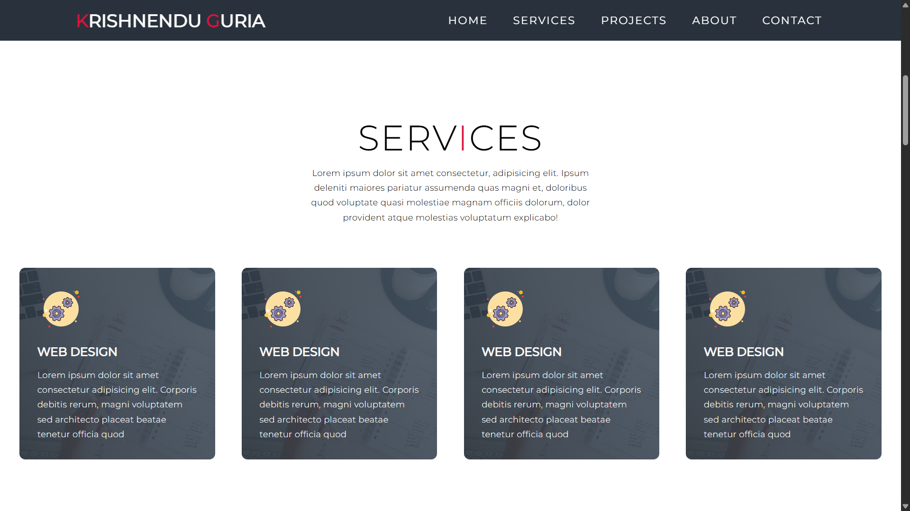
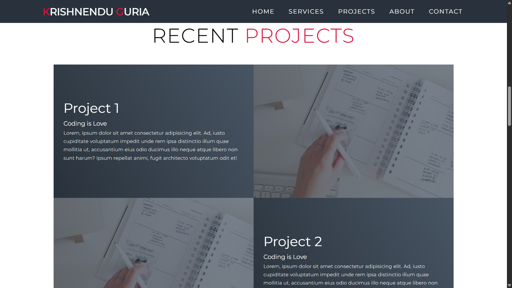
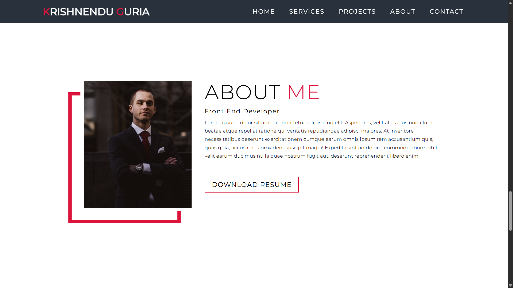
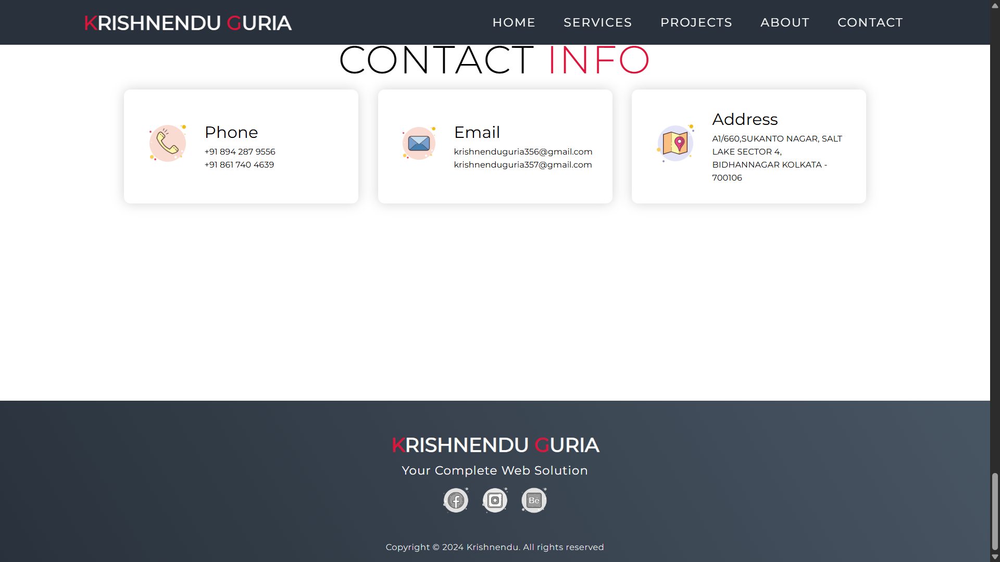

# Personal Portfolio Website

A modern, responsive, and interactive personal portfolio website built using HTML5, CSS3, and JavaScript. This project showcases my profile, skills, services, projects, and contact information through a clean and professional user interface. It is designed to provide visitors with an engaging experience while demonstrating my frontend development skills.

---

## Features

- Responsive design
- Modern and clean UI
- Interactive navigation
- Smooth scrolling
- Hero section
- About section
- Services section
- Projects section
- Contact section
- JavaScript-powered interactions
- Mobile-friendly layout

---

## Technologies Used

- HTML5
- CSS3
- JavaScript

---

## Project Structure

```
Personal_Portfolio/
│
├── index.html
├── style.css
├── script.js
├── images/
└── README.md
```

---

## About the Project

This portfolio website represents my skills and projects as a Frontend Developer. It is built with HTML, CSS, and JavaScript to create a responsive, interactive, and user-friendly experience. The website highlights my work, technical skills, and provides an easy way for visitors to learn more about me.

---

## Sections

- Home
- About
- Services
- Projects
- Contact

---
## 📸 Project Preview







## How to Run

1. Clone this repository.
2. Open the project folder.
3. Open `index.html` in your web browser.

---

## Future Improvements

- Dark/Light mode
- Project filtering
- Download resume feature
- Contact form with backend integration
- More animations and interactive effects

---

## Author

**Krishnendu Guria**

Frontend Developer | Computer Science Student

---

⭐ If you like this project, don't forget to give it a star on GitHub!
